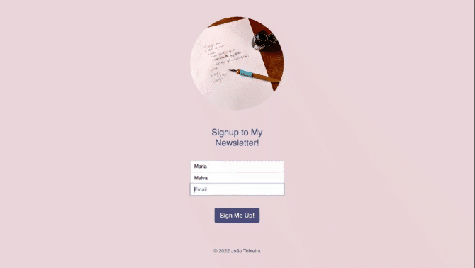

# 📬 Newsletter

## Live Page

https://radiant-caverns-66380.herokuapp.com/

##  📮 Overview

This is a single-page application where users can subscribe to a newsletter.

## ✉️ Features

-   Newsletter managed by Mailchimp.
   

## 📯 Technology

-   
  &nbsp;  &nbsp;  &nbsp;  &nbsp;   &nbsp;   

-   JavaScript, HTML, CSS, Node.js, Express.js, Heroku

## Preview

**_Page Layout_**

